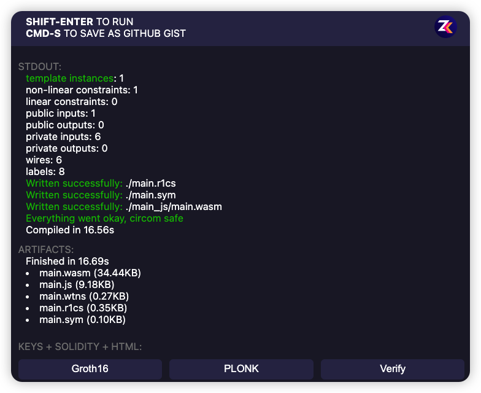
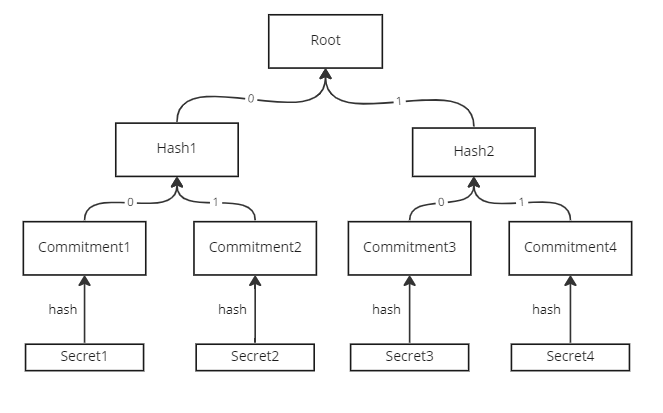
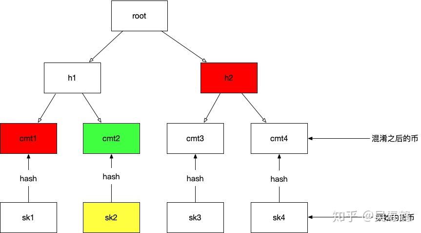

https://zkrepl.dev/


Demo#1

```
pragma circom 2.1.2;

// include "circomlib/poseidon.circom";
// include "https://github.com/0xPARC/circom-secp256k1/blob/master/circuits/bigint.circom";

template Example () {
    signal input x1;
    signal input x2;
    signal input x3;
    signal input x4;
    
    signal input y1;
    signal input y2;

    signal input out;

    // constraints, using "==="
    y1 === x1 + x2;
    y2 === y1 * x3;
    y2 === out + x4; 
}

// specify variables as public to verifier， here is "out", the rest if private.
component main { public [ out ] } = Example();

// JSON format. As input
/* INPUT = {
    "x1": "2",
    "x2": "4",
    "x3": "8",
    "x4": "5",
    "y1": "6",
    "y2": "48",
    "out": "43"
} */
```


shift + enter：compile and run




Demo #2: num to bits

```
pragma circom 2.1.2;

// include "circomlib/poseidon.circom";
// include "https://github.com/0xPARC/circom-secp256k1/blob/master/circuits/bigint.circom";

template Example () {
    signal input in;

    signal input b0;
    signal input b1;
    signal input b2;
    signal input b3;
    
    in === 8 * b3 + 4 * b2 + 2 * b1 + b0;
    0 === b0 * (b0 - 1);
		0 === b1 * (b1 - 1);
		0 === b2 * (b2 - 1);
		0 === b3 * (b3 - 1);
}

// specify variables as public to verifier， here is "out", the rest if private.
component main { public [ b0, b1, b2, b3 ] } = Example();

// JSON format. As input
/* INPUT = {
    "in": "11",
    "b0": "1",
    "b1": "1",
    "b2": "0",
    "b3": "1",
} */
```


```js
pragma circom 2.1.2;

// include "circomlib/poseidon.circom";
// include "https://github.com/0xPARC/circom-secp256k1/blob/master/circuits/bigint.circom";

template Example () {
    signal input in;

    signal input b[4];
    
    // in === 8 * b[3] + 4 * b[2] + 2 * b[1] + b[0];
  	var accum = 0;
  	for (var i = 0; i < 4; i++) {
      	accum += (2 ** i) * b[i];
    }
  
    
    // 0 === b[0] * (b[0] - 1);
		// 0 === b[1] * (b[1] - 1);
		// 0 === b[2] * (b[2] - 1);
		// 0 === b[3] * (b[3] - 1);
  
 		for (var i = 0; i < 4; i++) {
      0 === b[i] * (b[i] - 1);
    }
  
  	in === accum;
}

// specify variables as public to verifier， here is "out", the rest if private.
component main { public [ b ] } = Example();

// JSON format. As input
/* INPUT = {
    "in": "11",
    "b": ["1", "1", "0", "1"]
} */
```


```js
pragma circom 2.1.2;

// include "circomlib/poseidon.circom";
// include "https://github.com/0xPARC/circom-secp256k1/blob/master/circuits/bigint.circom";

template Example (nBits) {
    signal input in;

    signal input b[nBits];
    
    var accum;
  	for (var i = 0; i < nBits; i++) {
      	accum += (2 ** i) * b[i];
    }

    for (var i = 0; i < nBits; i++) {
      0 === b[i] * (b[i] - 1);
    }

    in === accum;

}

// specify variables as public to verifier， here is "out", the rest if private.
component main { public [ b ] } = Example(4);

// JSON format. As input
/* INPUT = {
    "in": "11",
    "b": ["1", "1", "0", "1"]
} */
```


补充：

`<--` 和  `-->` 操作符运算符只为信号分配一个值，而不创建任何约束。

`===` 操作符添加约束而不分配值。

如前所述，`<==` 为信号分配一个值并添加一个约束。 这意味着它只是 `<--`和 `===` 的组合。 但是，由于并非总是希望在同一步骤中同时完成这两个步骤，因此circom 的灵活性使我们可以将这一步分为两步。


混币器



例：commitment2对应的merkle path是 [commintment1, hash2]，merkle path index是[0, 1]





想取走图中绿色方块（`cmt2`）中的钱，那么他首先需要提供`cmt2`的`preimage`也就是图中的黄色小方块（`sk2`)，同时要提供一个从`cmt2`到`root`之间的`Merkle path`也就是图中标红的小方块（`cmt1`,`h2`)，还有一个`Merkle path索引(1,0)`索引是`(cmt1,h2)`在`Merkle tree`中的位置，索引看用于计算`nullifier`以及从`merkle path`计算`merkle root`。


```js
pragma circom 2.0.0;
include "../node_modules/circomlib/circuits/poseidon.circom"; 		// 引入poseidon hash函数

template GetMerkleRoot(k){	// k是树的深度，越深可以支持的叶子数越多（用户越多），但不宜过大
    // leaf是叶子节点的hash值，即commitment
    signal input leaf;
    // merkle path，即对应的兄弟节点的hash值，paths2_root[k]表示有k个输入
    signal input paths2_root[k];
    // merkle path index
    signal input paths2_root_pos[k];

		// 根节点的hash值
    signal output out;

    // hash of first two entries in tx Merkle proof，经过第一层计算，会得到hash1
    // k个component，每个component都是一个Poseidon函数
    component merkle_root[k];			
    merkle_root[0] = Poseidon(2);		// Poseidon(2)，两个输入
    
    // 左边的输入
    merkle_root[0].inputs[0] <== paths2_root[0] - paths2_root_pos[0] * (paths2_root[0] - leaf);
    // 右边的输入
    merkle_root[0].inputs[1] <== leaf - paths2_root_pos[0] * (leaf - paths2_root[0]);

    // hash of all other entries in tx Merkle proof
    for (var v = 1; v < k; v++){
        merkle_root[v] = Poseidon(2);
        merkle_root[v].inputs[0] <== paths2_root[v] - paths2_root_pos[v] * (paths2_root[v] - merkle_root[v-1].out);
        merkle_root[v].inputs[1]<== merkle_root[v-1].out - paths2_root_pos[v]* (merkle_root[v-1].out - paths2_root[v]);
    } 

    // output computed Merkle root
    out <== merkle_root[k-1].out;

}
```